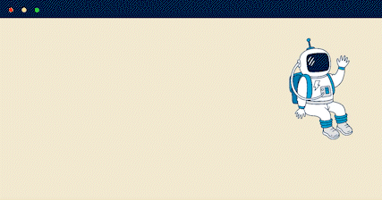

 
# Sou Lucas Silveira 🚀 ✨🚀 ✨🚀 ✨
### Desenvolvedor em ascenção e este é o meu repositório. 
  

- 👷 Analista de Tecnologia em LuizaLabs 
- 👨‍🎓 Estudante de Análise e desenvolvimento de sistemas na faculdade Descomplica
- 📚 Aluno da Alura e CodeAcademy
- 👩‍💻 Aprendendo muito sobre back-end
- 🇺🇸 Inglês Avançado

#### Pratico as seguintes tecnologias: 

   
   
  
  
  
  
  
  
---
  
  

##### Social:

  
   

